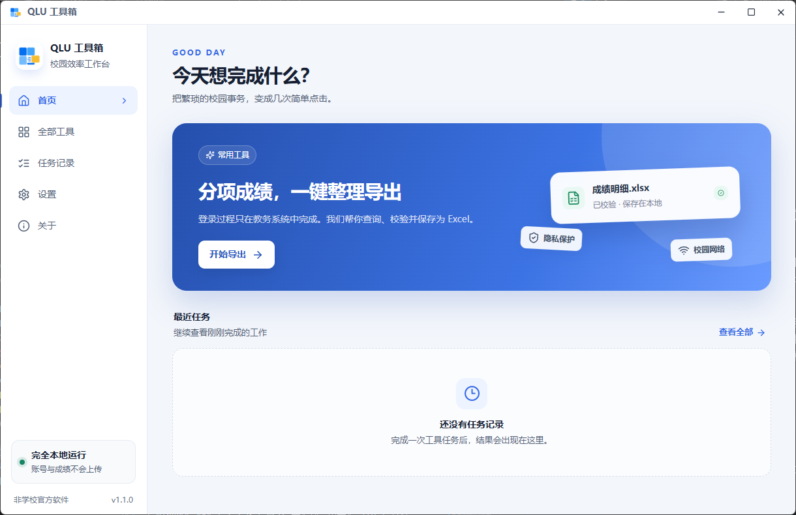
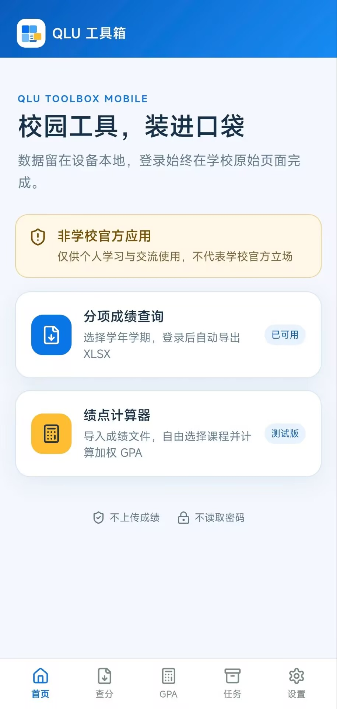

<p align="center">
  
</p>

<h1 align="center">QLU 工具箱</h1>

<p align="center">
  本地优先的非官方校园效率工具
</p>

<p align="center">
  
  
  
</p>

<p align="center">
  
  
  
  
  
</p>

<p align="center">
  <a href="#支持平台">支持平台</a> ·
  <a href="#桌面版">桌面版</a> ·
  <a href="#android-版">Android 版</a> ·
  <a href="#隐私与安全边界">隐私安全</a> ·
  <a href="#源码运行">开发指南</a> ·
  <a href="#交流与反馈">交流反馈</a>
</p>

<p align="center">
  面向齐鲁工业大学学生的非官方工具，提供分项成绩导出和 GPA 计算。<br>
  用户在独立浏览器或受限 WebView 中手动登录，成绩解析与计算均在本机完成。
</p>

## 支持平台

| 平台 | 当前版本 | 发布形式 | 说明 |
|---|---:|---|---|
| Windows x64 | 1.1.0 | NSIS 安装包、免安装 ZIP | 支持 Edge、Chrome 和按需下载的 Chromium |
| macOS Apple Silicon | 1.1.0 | DMG | 未签名、未公证，首次打开需在系统设置中确认 |
| Android 7.0 及以上 | 1.2.4（versionCode 9） | APK | 使用系统 WebView，支持系统文件保存和应用内更新检查 |

所有正式产物均发布在 [GitHub Releases](https://github.com/C1ouDreamW/qlu-toolbox/releases)。详细版本变化见 [CHANGELOG.md](CHANGELOG.md)。

## 桌面版

### 功能

- **分项成绩导出**：选择学年、学期和保存目录，在浏览器中手动登录后自动查询并导出 Excel。
- **结果校验**：保存前识别 XLS/XLSX，并核对工作簿中的实际学期，降低误保存其他学期数据的风险。
- **GPA 计算器**：读取分项成绩 XLSX，展示课程成绩分项，支持逐课勾选并计算总学分、总成绩点和加权平均 GPA。
- **任务记录**：保存成功、失败、取消和异常中断的任务状态。
- **本地设置**：管理默认目录、浏览器偏好、主题、更新检查和登录状态。
- **备用浏览器**：Edge 和 Chrome 均不可用时，可在应用内按需下载与当前 Playwright 版本匹配的 Chromium。

<p align="center">
  
</p>

### 下载与安装

前往 [GitHub Releases](https://github.com/C1ouDreamW/qlu-toolbox/releases) 下载对应平台的文件：

- Windows 推荐使用 `QLUToolbox_v*_x64_Setup.exe`。需要免安装使用时，下载 Windows ZIP，完整解压后运行 `QLUToolbox.exe`，不要只复制可执行文件。
- Apple Silicon Mac 下载 `QLUToolbox_v*_arm64.dmg`，打开后将 `QLUToolbox.app` 拖入“应用程序”。当前不提供 Intel Mac 版本。

macOS DMG 当前未使用 Apple 开发者证书签名或公证。首次启动若被阻止：

1. 先尝试打开一次 `QLUToolbox.app` 并关闭系统警告。
2. 前往“系统设置 → 隐私与安全性”。
3. 在“安全性”区域选择“仍要打开”并确认。

具体步骤见 [Apple 官方教程：打开来自未知开发者的 Mac App](https://support.apple.com/zh-cn/guide/mac-help/-mh40616/mac)。不要为了运行应用关闭 macOS 全局安全保护，也不要使用来源不明的安装包。

### 使用流程

1. 打开“分项成绩导出”，选择学年、学期和保存目录。
2. 在弹出的浏览器窗口中手动完成教务系统登录。
3. 返回工具箱确认继续，等待查询、校验和保存完成。
4. 可直接跳转到 GPA 计算器，也可稍后导入保存的 `.xlsx` 文件。

浏览器默认尝试顺序为 Microsoft Edge、Google Chrome、备用 Chromium，可在设置中调整首选浏览器。浏览器登录数据使用工具箱专用档案，不会读取日常浏览器个人资料。

若系统没有可用的 Edge 或 Chrome，应用会先征求同意，再下载备用 Chromium。首次下载约 180 MiB，安装后约占用 350 MiB，需要能够访问 Playwright 浏览器下载服务。

### 更新与本地数据

- 应用启动时可检查 GitHub Releases，也可在设置中手动检查；桌面版只提示更新，不自动下载安装。
- Windows 安装版可在关闭应用后直接运行新版安装程序覆盖升级；免安装版应完整解压新版并替换旧程序目录。
- macOS 使用新版 DMG 中的 `QLUToolbox.app` 替换旧版本。
- 覆盖升级不会删除设置、任务记录、浏览器档案或导出文件。

本地数据位置：

| 数据 | Windows | macOS |
|---|---|---|
| 设置 | `%APPDATA%\QLUToolbox\settings.json` | `~/Library/Application Support/QLUToolbox/settings.json` |
| 任务、日志和浏览器数据 | `%LOCALAPPDATA%\QLUToolbox` | `~/Library/Application Support/QLUToolbox` |
| 导出文件 | 用户选择的目录，默认通常为“下载” | 用户选择的目录，默认通常为“下载” |

浏览器档案可能包含 Cookie 等敏感会话数据，请勿上传或分享。完整路径可在“设置 → 数据管理”中查看。

## Android 版

### 功能

- **独立教务 WebView**：只允许齐鲁工业大学教务和统一认证域名的 HTTPS 导航，不暴露通用 JavaScript Bridge。
- **手动登录与会话管理**：在 WebView 中完成登录和验证码操作，可选择保留或清除登录状态。
- **本地成绩导出**：在同一登录会话中查询和导出，校验文件头、大小、SHA-256、ZIP 结构和实际学期。
- **系统文件保存**：通过 Android 系统文件选择器保存 XLSX，支持取消后再次保存、打开和分享。
- **本地 GPA 计算**：可直接读取刚导出的结果，也可从系统文件选择器导入分项成绩 XLSX。
- **任务恢复**：使用 Room 保存任务状态，对冷启动遗留任务和 Activity 重建提供可解释的中断处理。
- **安全更新**：下载 APK 后校验文件大小、SHA-256、applicationId、versionCode 和签名证书，再交给系统安装。

<p align="center">
  
</p>

### 下载与安装

1. 从 [GitHub Releases](https://github.com/C1ouDreamW/qlu-toolbox/releases) 下载 `QLU-Toolbox-Android-v*.apk`。
2. 在 Android 系统设置中允许当前浏览器或文件管理器“安装未知应用”。
3. 打开 APK 完成安装；安装后可关闭该来源的安装权限。

正式 Android 应用 ID 为 `io.github.c1oudreamw.lumatile`。

### 使用流程

1. 确保手机可以访问 `https://jw.qlu.edu.cn/`。校外环境可能需要用户自行通过 aTrust 或学校提供的网络方式建立连接。
2. 打开分项成绩导出，选择学年和学期。
3. 在独立 WebView 中手动完成统一身份认证。
4. 等待应用查询、下载并校验工作簿。
5. 使用系统文件选择器保存，或直接将临时结果交给 GPA 计算器。

Android 版不安装、启动或控制 aTrust，也不申请 VPN 控制权限。网络不可用时，请先确认校园网、aTrust、DNS、TLS 和教务系统状态。

### 更新与本地数据

- 应用会读取公开更新清单并提示新版；用户确认后才会下载 APK。
- 更新 APK 只有在摘要、包名、版本和签名校验通过后才会交给 Android 系统安装。
- Room 任务数据库、WebView 登录状态和应用设置保存在应用私有目录。
- 导出中的临时文件保存在应用缓存中并有有效期；永久文件仅保存到用户在系统文件选择器中指定的位置。
- 卸载应用通常会删除应用私有数据，但不会自动删除用户已经保存到公共文档目录的 XLSX。

当前 Android 版仍显示“QLU 工具箱”；后续 LumaTile 版本必须保持相同 applicationId 和正式签名，并递增 versionCode，才能覆盖安装并保留应用数据。

更多 Android 构建和签名说明见 [`apps/mobile/README.md`](apps/mobile/README.md)。

## 隐私与安全边界

- 应用不建设代登录、Cookie 中转或成绩云端存储服务。
- 账号、密码、验证码和 Cookie 不会发送到开发者服务器。
- 成绩文件和 GPA 结果只在本地处理；用户主动通过其他应用分享文件不在此范围内。
- 桌面登录状态保存在专用浏览器档案，Android 登录状态保存在应用 WebView 数据中，均可由用户清除。
- Android 对顶层导航、TLS、XLSX 和更新 APK 进行额外校验；桌面版通过 Electron 沙箱、上下文隔离和预加载层限制渲染进程权限。

本项目不是齐鲁工业大学官方软件，与学校及教务系统服务商不存在隶属、授权、合作或担保关系。学校系统、认证流程和页面结构变化可能导致功能暂时不可用。

## 源码运行

### 环境要求

- Node.js 22
- npm
- [uv](https://docs.astral.sh/uv/)
- Python 3.12，由 uv 按 `.python-version` 准备
- Android 开发额外需要 JDK 21、Android SDK 36 和可用的 Android Gradle 工具链

安装根 workspace 和 Python 依赖：

```powershell
uv sync --locked
npm ci
```

### 桌面端

首次启动开发环境前先编译 Electron 主进程：

```powershell
npm run build:electron
npm run dev
```

修改 `electron/` 下的 TypeScript 后，需要重新执行 `npm run build:electron` 再重启开发进程。桌面端验证命令：

```powershell
uv run --locked python -B -m unittest discover -s tests -v
npm run typecheck
npm run build
```

构建发布产物：

```powershell
# Windows NSIS 安装包
npm run dist:installer

# Windows 免安装 ZIP
npm run dist:zip
```

在 Apple Silicon Mac 上构建 DMG：

```bash
npm run dist:mac -- --arm64
```

桌面产物输出到 `release/`；Python Worker 构建中间产物输出到 `backend-dist/` 和 `backend-build/`。

### Android 端

验证共享领域逻辑并构建移动 Web 资源：

```powershell
npm test --workspace @lumatile/academic-core
npm run mobile:build
npm run mobile:sync
```

构建 Android Debug APK：

```powershell
cd apps/mobile/android
./gradlew.bat testDebugUnitTest assembleDebug
```

APK 输出到 `apps/mobile/android/app/build/outputs/apk/debug/app-debug.apk`。Release APK 必须配置长期正式签名，具体环境变量和密钥库要求见 [`apps/mobile/README.md`](apps/mobile/README.md)。

## 项目结构

```text
src/                                  桌面 Vue 页面、组件和状态
electron/                             Electron 主进程、preload 和 Python IPC 客户端
main.py                               Python Bridge 与 Worker 统一入口
qlu_toolbox/bridge.py                 设置、任务、浏览器组件和 Worker 调度
qlu_toolbox/core/                     路径、设置、任务数据库和工具定义
qlu_toolbox/modules/grade_export/     桌面分项成绩导出领域与 Playwright Worker
qlu_toolbox/modules/gpa_calculator/   桌面 XLSX 解析与 GPA 规则
apps/mobile/src/                      Android 端 Vue、Capacitor 和 Web Worker 代码
apps/mobile/android/                  Kotlin Activity、原生插件、Room 和 Gradle 工程
packages/contracts/                   移动端共享 TypeScript 数据契约
packages/academic-core/               学期、导出参数、成绩解析和 GPA 领域逻辑
tests/                                Python 单元与 Bridge 集成测试
.github/workflows/                    Windows、macOS、Android CI 与 Release 流程
updates/android.json                  Android 公开更新清单
docs/                                 移动端方案、产品与发布文档
```

桌面端和 Android 端使用不同的自动化与文件处理实现，但目标是在学年、学期、导出字段、课程分组和 GPA 结果上保持一致。移动端共享规则集中在 `packages/academic-core`；桌面端对应规则位于 Python 领域模块。

## 当前限制

- 仅适配 `https://jw.qlu.edu.cn/` 当前使用的教务系统和统一认证流程。
- 登录、教务查询和 GitHub 更新检查均依赖用户当前网络环境。
- 桌面端登录等待时间为 15 分钟。
- macOS 仅提供 Apple Silicon 版本，DMG 尚未签名或公证。
- Windows 安装包尚未数字签名，可能触发 SmartScreen 来源提示。
- Android 依赖设备的 System WebView，不承诺所有厂商系统和 WebView 版本均已验证。
- 当前不提供 iOS 版本。

## 交流与反馈

- QLU 工具箱 QQ 交流群：`438767737`
- 联系邮箱：[cloud_aaa@163.com](mailto:cloud_aaa@163.com)
- Bug 与功能建议：[GitHub Issues](https://github.com/C1ouDreamW/qlu-toolbox/issues/new/choose)
- 安全与隐私问题：[SECURITY.md](SECURITY.md)
- 版本发布：[GitHub Releases](https://github.com/C1ouDreamW/qlu-toolbox/releases)
- 其他学校适配版本：[SDNU 工具箱](https://github.com/LoMoCatAp/sdnu-toolbox)，经授权基于本项目改造并由其维护者独立发布和支持

提交问题时请注明应用版本、平台、系统版本、处理器架构、复现步骤、预期结果和实际结果。请勿在公开 Issue 中上传账号、密码、验证码、Cookie、成绩文件或未经脱敏的日志；涉及安全、隐私或个人信息的问题请通过邮箱私下联系。

## 使用说明与免责声明

本项目仅供个人学习、交流和非商业用途。未经开发者明确书面许可，禁止将本项目或其修改版本用于收费服务、商业产品、商业推广、代运营或其他营利活动。

软件按相应接口和系统现状提供，不保证功能持续可用，也不保证导出结果绝对完整或准确。使用者应仅处理本人有权访问的数据，遵守学校规定、目标系统规则及适用法律法规，并自行承担使用、误用或无法使用软件产生的风险和后果。在适用法律允许的范围内，开发者不承担由此造成的账号、数据、学业、设备或其他损失。
